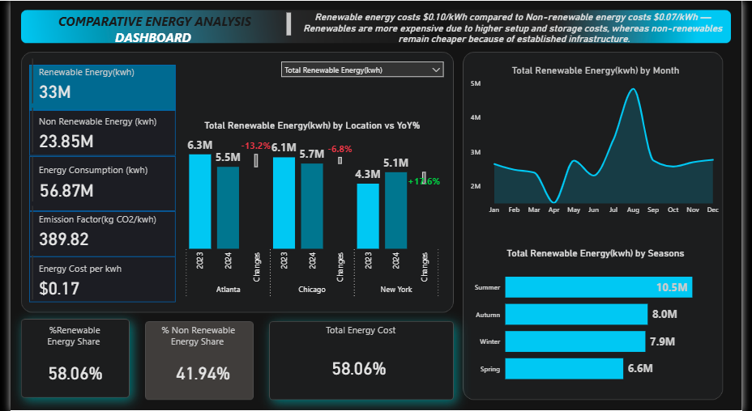

Comparative-Energy-Analysis-Dashboard

A Power BI dashboard comparing renewable and non-renewable energy consumption, cost, and trends across multiple locations.

Project Overview
This project was built in response to a request for an Energy Dashboard providing insights into energy consumption, cost efficiency, and emissions. The brief asked for a comparison between renewable and non-renewable energy usage, a breakdown of consumption across months and seasons, and an analysis of cost differences between energy types, focused on three locations: Atlanta, Chicago, and New York. The dashboard was designed with a modern, dark-themed layout to clearly highlight key metrics and trends.

Tools Used
Multiple CSV files covering energy consumption, cost, and location data were gathered and combined into a single data model using Power Query within Power BI, where the data was also cleaned and transformed. DAX measures were then used to build multiple calculated tables for deeper analysis. The final dashboard was designed in Power BI with an interactive, dark-themed layout.

Key Insights
Renewable energy costs 0.10 dollars per kWh compared to 0.07 dollars per kWh for non-renewable energy, due to higher setup and storage costs for renewables. Total renewable energy usage was 33M kWh, while total non-renewable energy usage was 23.85M kWh, bringing total energy consumption to 56.87M kWh. The emission factor was recorded at 389.82 kg CO2 per kWh. Renewable energy made up 58.06 percent of the total energy share, while non-renewable made up 41.94 percent. Seasonal analysis showed summer had the highest renewable energy usage at 10.5M kWh, followed by autumn at 8.0M, winter at 7.9M, and spring at 6.6M. Among the three locations, Atlanta had the highest total renewable energy usage, though all three locations saw a year over year decline from 2023 to 2024.

Dashboard Preview

Files in this Repo
This repository includes the Power BI dashboard file, a preview image of the dashboard, and the original project brief describing the requirements.

How to Use
Clone or download this repository, then open the Power BI file in Power BI Desktop to explore the interactive dashboard.
